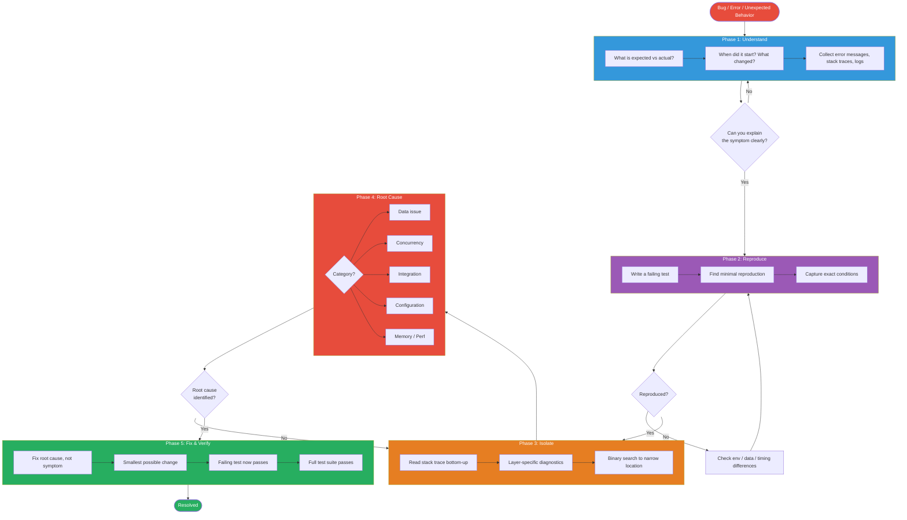
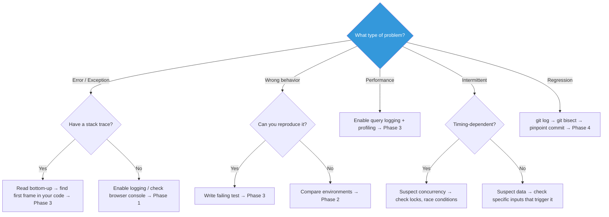

Structured troubleshooting methodology — follow this process for every bug, error, or unexpected behavior.

## Process Overview



## Decision Tree: Where to Start



## Phase 1: Understand Before Touching

Before changing any code, answer these questions:

1. **What is the expected behavior?** — Get specific. "It should work" is not an answer.
2. **What is the actual behavior?** — Exact error messages, stack traces, HTTP status codes, screenshots.
3. **When did it start?** — Check `git log` for recent changes. If regression, `git bisect` to pinpoint the commit.
4. **What changed?** — New dependency? Config change? Upstream API change? Data migration?

**RULE**: Do NOT guess at fixes. Do NOT change code until you can explain the root cause.

## Phase 2: Reproduce

A bug you can't reproduce is a bug you can't fix.

1. **Write a failing test first** — This is the single most important step. If you can capture the failure in a test, you've won half the battle.
2. **Minimal reproduction** — Strip away everything that isn't related. Smallest input, fewest dependencies, simplest config.
3. **Capture the exact conditions** — Environment, data state, request payload, timing, user role/permissions.

If you cannot reproduce:
- Check if it's environment-specific (dev vs. prod config differences)
- Check if it's data-specific (query with the exact IDs/values from the report)
- Check if it's timing-specific (race condition, timeout, cache expiry)
- Ask for logs from the environment where it occurs

## Phase 3: Isolate

Narrow the blast radius. Where exactly does the failure occur?

### Read the Stack Trace
- Start from the **bottom** (root cause), not the top (symptom)
- Identify the first frame in **your code** — that's where to start investigating
- `Caused by:` is more important than the top-level exception

### Diagnostic Techniques (by layer)

```mermaid
flowchart LR
    subgraph Frontend
        FE1[Browser DevTools]
        FE2[Network tab]
        FE3[Console errors]
    end

    subgraph API
        API1[curl / test client]
        API2[Check headers & auth]
        API3[Check CORS]
    end

    subgraph Service
        SVC1[Log entry/exit + params]
        SVC2[Check @Transactional]
        SVC3[Check error handling]
    end

    subgraph Messaging
        MQ1[Queue depth]
        MQ2[Dead letters]
        MQ3[Consumer status]
    end

    subgraph Database
        DB1[Show SQL / EXPLAIN]
        DB2[Run query directly]
        DB3[Check locks & connections]
    end

    subgraph Config
        CFG1[Resolved properties]
        CFG2[Active profile]
        CFG3[Env variables]
    end

    Frontend -->|HTTP request| API
    API -->|method call| Service
    Service -->|publish| Messaging
    Service -->|query| Database
    Config -.->|affects all layers| Frontend
    Config -.-> API
    Config -.-> Service
    Config -.-> Database

    style Frontend fill:#3498db,color:#fff
    style API fill:#2ecc71,color:#fff
    style Service fill:#9b59b6,color:#fff
    style Messaging fill:#e67e22,color:#fff
    style Database fill:#e74c3c,color:#fff
    style Config fill:#95a5a6,color:#fff
```



| Layer | Technique |
|---|---|
| **Frontend** | Browser DevTools → Network tab (check request/response), Console (JS errors), Application tab (storage/cookies). |
| **API** | Use `curl` or test client to call the endpoint directly. Check request/response headers. Verify auth tokens. Check CORS. |
| **Service** | Add targeted log statements at method entry/exit with parameter values. Check transactional boundaries. |
| **Messaging** | Check RabbitMQ management UI (or logs) for queue depth, dead letters, rejected messages. |
| **Database** | Check the actual SQL being executed (enable `spring.jpa.show-sql` or query logging). Run the query directly. Check EXPLAIN plan. Verify data exists. |
| **Config** | Print resolved config values at startup. Check profile activation. Check property precedence. |

### Binary Search Strategy
When the failure path is long, cut it in half:
- Add a check at the midpoint of the suspected code path
- Determine which half contains the bug
- Repeat until isolated to a few lines

## Phase 4: Root Cause Analysis

Identify **why**, not just **where**.

### Common Root Causes by Category

**Data Issues**
- Null where non-null expected (missing DB column default, optional relationship)
- Stale cache returning outdated data
- Character encoding (UTF-8 vs. Latin-1)
- Timezone mismatches (UTC in DB, local in app, different timezone in UI)

**Concurrency**
- Race condition: two requests modifying the same resource
- Deadlock: check DB lock waits, thread dumps
- Stale read: missing `@Transactional` or wrong isolation level

**Integration**
- Upstream API changed contract (new required field, different error format)
- Timeout too short for slow downstream
- Retry logic causing duplicate side effects (non-idempotent operations)
- SSL/TLS certificate expired or untrusted

**Configuration**
- Wrong profile active (`dev` config in `prod`)
- Environment variable not set or set to wrong value
- Dependency version conflict (check dependency tree for duplicates)

**Memory / Performance**
- N+1 queries: enable SQL logging, count queries per request
- Memory leak: heap dump, check for growing collections or unclosed resources
- Connection pool exhaustion: check pool stats, look for leaked connections

## Phase 5: Fix and Verify

1. **Fix the root cause, not the symptom** — If a NullPointerException occurs because data is missing, fix the data pipeline, don't just add a null check.
2. **Make the smallest possible change** — Resist the urge to refactor while fixing.
3. **Run the failing test** — It must pass now.
4. **Run the full test suite** — Ensure no regressions.
5. **Verify in the original reproduction scenario** — Same data, same conditions.

## Anti-Patterns — Never Do These

| Anti-Pattern | Why It's Wrong | Do This Instead |
|---|---|---|
| Shotgun debugging (change random things until it works) | You don't know what fixed it, or if it's truly fixed | Follow the isolation process |
| Adding `try/catch` to suppress the error | Hides the bug, doesn't fix it | Let it fail loudly, fix the cause |
| "It works on my machine" | Ignores environment differences | Reproduce in the failing environment's conditions |
| Restarting the service to "fix" it | Masks the root cause, it will recur | Find why the state became corrupted |
| Fixing forward without understanding | Creates tech debt and fragile code | Spend the time to understand root cause |
| Commenting out broken code | Loses functionality silently | Fix the code or remove it with intention |

## Stack-Specific Quick References

### Spring Boot
```
# Show all resolved config
--debug flag or /actuator/env

# Enable SQL logging
spring.jpa.show-sql=true
spring.jpa.properties.hibernate.format_sql=true
logging.level.org.hibernate.SQL=DEBUG
logging.level.org.hibernate.type.descriptor.sql.BasicBinder=TRACE

# Thread dump
kill -3 <pid>  OR  /actuator/threaddump

# Heap dump
jmap -dump:format=b,file=heap.hprof <pid>  OR  /actuator/heapdump
```

### Node.js
```
# Enable debug logging
DEBUG=express:* node app.js
NODE_DEBUG=http,net node app.js

# Inspect memory
node --inspect app.js  → Chrome DevTools
node --heap-prof app.js

# Check event loop lag
process.hrtime() before/after async operations
```

### Angular
```
# Enable verbose compilation
ng build --verbose

# Check bundle size
ng build --stats-json → webpack-bundle-analyzer

# Runtime debugging
ng.getComponent(element)  — in browser console
ng.profiler.timeChangeDetection()  — measure CD cycles
```

### Database
```sql
-- MySQL: check slow queries
SHOW PROCESSLIST;
SHOW FULL PROCESSLIST;
SET GLOBAL slow_query_log = 'ON';

-- MySQL: check locks
SELECT * FROM information_schema.INNODB_LOCK_WAITS;
SELECT * FROM performance_schema.data_locks;

-- Oracle: check locks
SELECT * FROM V$LOCK WHERE BLOCK = 1;
SELECT * FROM V$SESSION WHERE BLOCKING_SESSION IS NOT NULL;
```
