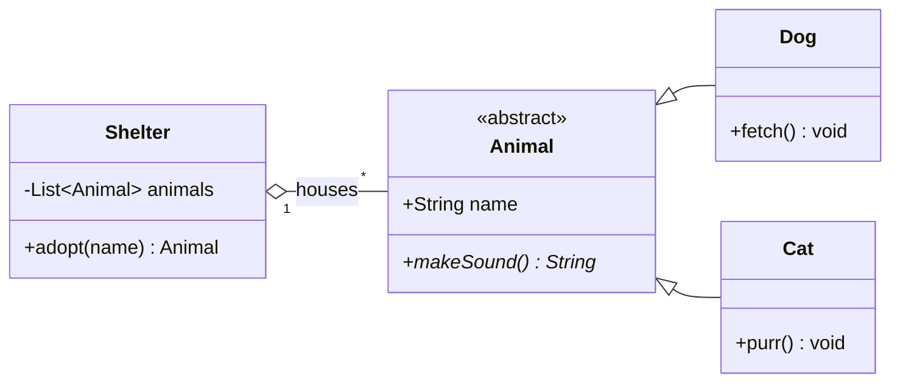

# Class Diagram Reference

## Declaration

```
classDiagram
```

Optional direction: `direction TB` (or `LR`, `RL`, `BT`)

## Defining Classes

**Bracket notation:**
```
class Animal {
    +String name
    +int age
    +makeSound() String
}
```

**Colon notation:**
```
class Animal
Animal : +String name
Animal : +makeSound()
```

## Visibility Modifiers

| Symbol | Meaning |
|--------|---------|
| `+` | Public |
| `-` | Private |
| `#` | Protected |
| `~` | Package/Internal |

## Method/Field Classifiers

- Abstract method: `someMethod()*`
- Static method: `someMethod()$`
- Static field: `String field$`

## Return Types

```
class Calc {
    +add(a, b) int
    +divide(a, b) float
}
```

## Generics

Use tildes `~`:
```
class List~T~ {
    +add(T item)
    +get(index) T
}
```

## Relationships

| Type | Syntax | Description |
|------|--------|-------------|
| Inheritance | `A <\|-- B` | B extends A |
| Composition | `A *-- B` | A owns B (strong) |
| Aggregation | `A o-- B` | A has B (weak) |
| Association | `A --> B` | A uses B |
| Dependency | `A ..> B` | A depends on B |
| Realization | `A ..\|> B` | B implements A |
| Solid link | `A -- B` | Undirected |
| Dashed link | `A .. B` | Undirected dashed |

## Labels on Relationships

```
ClassA --> ClassB : uses
ClassA "1" --> "*" ClassB : contains
```

## Cardinality

Place in quotes: `"1"`, `"0..1"`, `"1..*"`, `"*"`, `"n"`, `"0..n"`

```
Customer "1" --> "*" Order : places
```

## Annotations

```
class Shape {
    <<interface>>
    +draw()
}

class Color {
    <<enumeration>>
    RED
    GREEN
    BLUE
}
```

Options: `<<Interface>>`, `<<Abstract>>`, `<<Service>>`, `<<Enumeration>>`

## Namespaces

```
namespace BaseShapes {
    class Triangle
    class Rectangle
}
```

## Notes

```
note "General note"
note for ClassName "Specific note"
```

## Styling

```
classDef highlight fill:#f96,stroke:#333
class MyClass highlight
%% or inline:
class MyClass:::highlight
```

## Comments

```
%% This is a comment
```

## Example

