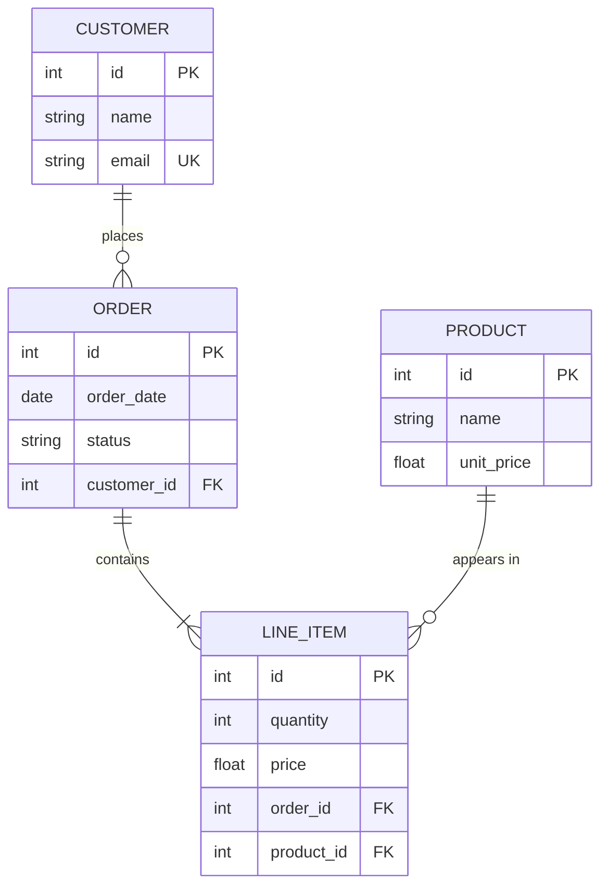

# Entity Relationship Diagram Reference

## Declaration

```
erDiagram
```

## Entities

Defined implicitly via relationships or explicitly with attributes:
```
CUSTOMER {
    int id PK
    string name
}
```

Use singular nouns, typically UPPERCASE. Spaces allowed with double quotes: `"Order Item"`.

## Attributes

```
ENTITY {
    type name key "comment"
}
```

- **type**: Data type (string, int, float, date, etc.)
- **name**: Attribute name
- **key** (optional): `PK`, `FK`, `UK` — can combine: `PK, FK`
- **comment** (optional): In double quotes

```
ORDER {
    int id PK "Auto-generated"
    date created_at
    string status
    int customer_id FK
}
```

## Relationships

Syntax: `ENTITY1 <cardinality>--<cardinality> ENTITY2 : "label"`

### Cardinality Markers (Crow's Foot)

| Left | Right | Meaning |
|------|-------|---------|
| `\|\|` | `\|\|` | Exactly one |
| `\|o` | `o\|` | Zero or one |
| `}\|` | `\|{` | One or more |
| `}o` | `o{` | Zero or more |

### Line Type

- `--` Identifying (solid line) — child depends on parent
- `..` Non-identifying (dashed line) — independent entities

### Reading

Read left-to-right: `CUSTOMER ||--o{ ORDER : "places"` means "one customer places zero or more orders."

## Common Patterns

**One-to-many:**
```
CUSTOMER ||--o{ ORDER : "places"
```

**Many-to-many (via junction):**
```
STUDENT }o--o{ COURSE : "enrolls in"
STUDENT ||--o{ ENROLLMENT : "has"
COURSE ||--o{ ENROLLMENT : "has"
```

**One-to-one:**
```
USER ||--|| PROFILE : "has"
```

**Optional relationship:**
```
EMPLOYEE |o--o| PARKING_SPOT : "assigned"
```

## Entity Aliases

```
CUSTOMER["Customer Account"] {
    int id PK
}
```

## Comments

```
%% This is a comment
```

## Example

