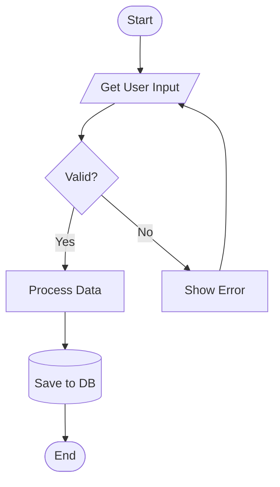

# Flowchart Reference

## Declaration

```
flowchart TD
```

Directions: `TB`/`TD` (top-down), `BT` (bottom-up), `LR` (left-right), `RL` (right-left)

## Node Shapes

| Shape | Syntax |
|-------|--------|
| Rectangle | `A["Text"]` |
| Rounded | `A(Text)` |
| Stadium | `A([Text])` |
| Subroutine | `A[[Text]]` |
| Cylinder/DB | `A[(Text)]` |
| Circle | `A((Text))` |
| Diamond/Decision | `A{Text}` |
| Hexagon | `A{{Text}}` |
| Parallelogram | `A[/Text/]` |
| Trapezoid | `A[/Text\]` |
| Double circle | `A(("Text"))` |
| Asymmetric | `A>Text]` |

## Links

| Type | Syntax |
|------|--------|
| Arrow | `A --> B` |
| Open | `A --- B` |
| Text on arrow | `A -->|text| B` |
| Alt text syntax | `A -- text --> B` |
| Dotted arrow | `A -.-> B` |
| Dotted text | `A -. text .-> B` |
| Thick arrow | `A ==> B` |
| Thick text | `A == text ==> B` |
| Invisible | `A ~~~ B` |
| Bidirectional | `A <--> B` |
| Circle end | `A --o B` |
| Cross end | `A --x B` |

Longer links: add dashes (`--->`, `---->`) for more length.

## Chaining

```
A --> B --> C
A & B --> C & D
```

## Subgraphs

```
subgraph id[Title]
    direction LR
    A --> B
end
```

Link to/from subgraphs: `id --> C` or `C --> id`

## Styling

```
style nodeId fill:#f9f,stroke:#333,stroke-width:4px
classDef className fill:#f9f,stroke:#333
A:::className --> B
classDef default fill:#f9f,stroke:#333
linkStyle 0 stroke:#ff3,stroke-width:4px
```

## Markdown in Nodes

```
A["`**bold** and _italic_`"]
```

## Comments

```
%% This is a comment
```

## Example

