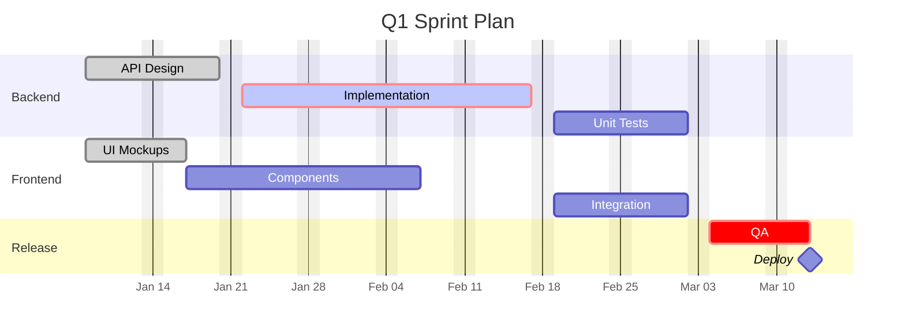

# Gantt Chart Reference

## Declaration

```
gantt
```

## Header Configuration

```
gantt
    title Project Timeline
    dateFormat YYYY-MM-DD
    axisFormat %b %d
    excludes weekends
    todayMarker off
```

- **title**: Chart heading (optional)
- **dateFormat**: Input date parsing format (default: `YYYY-MM-DD`)
- **axisFormat**: Display format on axis using d3 tokens (`%Y`, `%m`, `%d`, `%b`, `%H`, `%M`)
- **excludes**: Skip days — `weekends`, specific dates, or `wednesday`
- **todayMarker**: Style or `off`
- **tickInterval**: Axis spacing — `1day`, `1week`, `1month`

## Sections

```
section Planning
section Development
section Testing
```

## Task Syntax

```
taskName : [tags], [id], [start], [end/duration]
```

**Tags** (combinable, must come first):
- `done` — completed task
- `active` — in-progress task
- `crit` — critical task (highlighted)
- `milestone` — single point in time

**Start**: A date (`2024-01-15`) or `after taskId`

**End/Duration**: A date or duration (`30d`, `1w`, `1h`)

## Examples

```
Design     : done, des1, 2024-01-01, 30d
Coding     : active, crit, dev1, after des1, 45d
Testing    : test1, after dev1, 20d
Launch     : milestone, m1, after test1, 0d
```

## Dependencies

Reference task IDs with `after`:
```
Task B : b1, after a1, 10d
Task C : c1, after a1 b1, 5d
```

Multiple dependencies: `after taskA taskB` (space-separated).

## Exclusions

```
excludes weekends
excludes 2024-12-25, 2024-12-26
weekend friday
```

## Compact Mode

```
%%{init: { 'gantt': { 'displayMode': 'compact' } } }%%
```

## Comments

```
%% This is a comment
```

## Example

