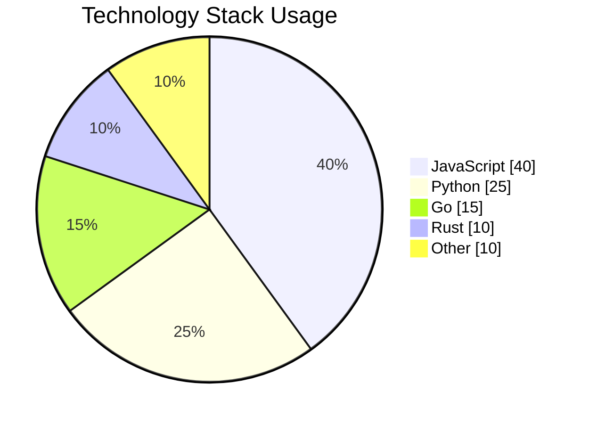

# Pie Chart Reference

## Declaration

```
pie
```

## Options

- **title**: Chart heading
- **showData**: Display numeric values alongside legend

```
pie showData title Budget Allocation
```

## Data Entries

Each slice: `"Label" : value`

```
"Label" : positiveNumber
```

- Labels must be in double quotes
- Values must be positive numbers (> 0)
- Up to two decimal places
- Slices render clockwise in declaration order
- Percentages are calculated automatically

## Configuration

| Parameter | Description | Default |
|-----------|-------------|---------|
| `textPosition` | Label position (0.0 = center, 1.0 = edge) | `0.75` |

## Comments

```
%% This is a comment
```

## Example

