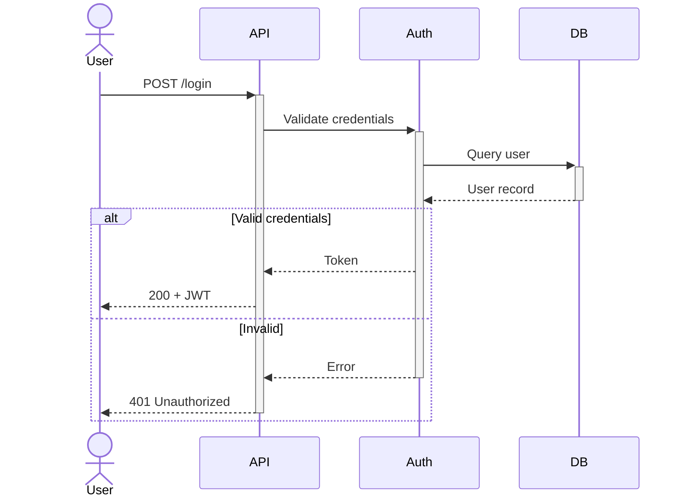

# Sequence Diagram Reference

## Declaration

```
sequenceDiagram
```

## Participants & Actors

```
participant A as Alice
actor B as Bob
```

Participant types: `participant` (box), `actor` (stick figure)

Render order follows declaration order.

## Grouping (Boxes)

```
box Aqua Backend Services
    participant API
    participant DB
end
```

Supports color names, `rgb()`, `rgba()`, and `transparent`.

## Arrow Types

| Type | Syntax | Description |
|------|--------|-------------|
| Solid arrow | `->>` | Synchronous request |
| Dotted arrow | `-->>` | Response/return |
| Solid line | `->` | No arrowhead |
| Dotted line | `-->` | No arrowhead |
| Solid cross | `-x` | Lost message |
| Dotted cross | `--x` | Lost message |
| Solid open | `-)` | Async message |
| Dotted open | `--)` | Async message |
| Bidirectional | `<<->>` | Two-way |

Syntax: `Actor1->>Actor2: Message text`

## Activations

```
activate A
A->>B: Request
deactivate A
```

Shorthand with `+`/`-`:
```
A->>+B: Request
B-->>-A: Response
```

## Notes

```
Note right of A: Text
Note left of A: Text
Note over A: Text
Note over A,B: Spanning note
```

Line breaks: use `<br/>` in text.

## Control Flow

**Loop:**
```
loop Every 5 seconds
    A->>B: Heartbeat
end
```

**Alt/Else:**
```
alt Success
    A->>B: 200 OK
else Failure
    A->>B: 500 Error
end
```

**Optional:**
```
opt Has cache
    A->>Cache: Get
end
```

**Parallel:**
```
par Task 1
    A->>B: Request 1
and Task 2
    A->>C: Request 2
end
```

**Critical:**
```
critical Establish connection
    A->>B: Connect
option Network timeout
    A->>A: Retry
end
```

**Break:**
```
break Auth failed
    B-->>A: 401 Unauthorized
end
```

## Background Highlighting

```
rect rgba(0, 0, 255, 0.1)
    A->>B: Highlighted
end
```

## Autonumbering

```
sequenceDiagram
    autonumber
```

## Create/Destroy Participants

```
create participant C
A->>C: Spawn
destroy C
C->>A: Done
```

## Comments

```
%% This is a comment
```

## Example

