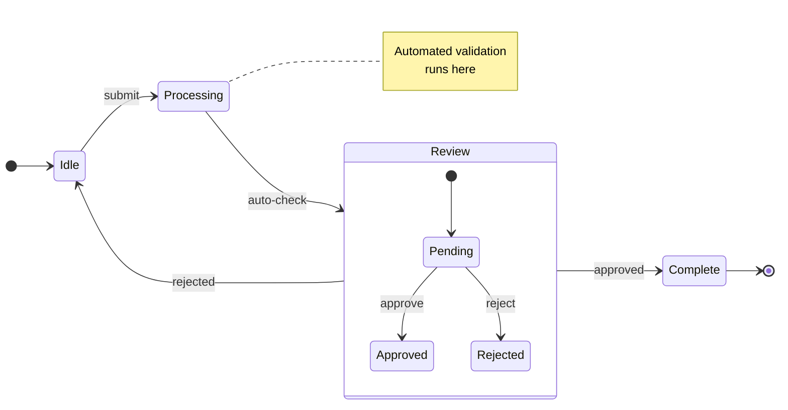

# State Diagram Reference

## Declaration

```
stateDiagram-v2
```

Use `stateDiagram-v2` (preferred) or `stateDiagram`.

Optional direction: `direction LR` (or `TB`, `BT`, `RL`)

## States

**Simple:**
```
StateA
```

**With description:**
```
StateA : Description text
```

**With alias (spaces in names):**
```
state "Waiting for Input" as WaitingForInput
```

## Transitions

```
StateA --> StateB
StateA --> StateB : event or condition
```

## Start & End

```
[*] --> FirstState
LastState --> [*]
```

`[*]` is start when on the left, end when on the right.

## Composite (Nested) States

```
state ActiveState {
    [*] --> Idle
    Idle --> Running : start
    Running --> Idle : stop
}
```

Multiple nesting levels supported. Cannot transition directly between internals of different composites.

## Fork & Join

```
state fork_state <<fork>>
state join_state <<join>>

StateA --> fork_state
fork_state --> Path1
fork_state --> Path2
Path1 --> join_state
Path2 --> join_state
join_state --> StateB
```

## Choice (Decision)

```
state check <<choice>>
StateA --> check
check --> Approved : condition met
check --> Rejected : condition not met
```

## Concurrency

Parallel regions inside a state using `--`:
```
state Parallel {
    AudioPlaying
    --
    VideoRendering
}
```

## Notes

```
note right of StateA
    Multi-line note
    about this state
end note

note left of StateB : Single line note
```

## Styling

```
classDef critical fill:#f00,color:white,font-weight:bold
class CrashState critical
%% or inline:
StateA:::critical --> StateB
```

Cannot apply classDef to `[*]` or composite states.

## Comments

```
%% This is a comment
```

## Example

